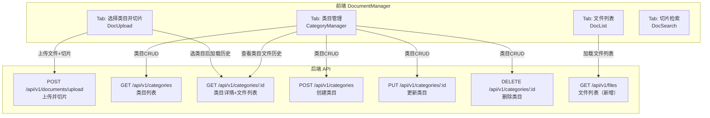

# 设计文档：文档上传与切片功能优化

## 概述

本次重构采用**方案B**，核心思路是：由于系统没有独立的文件存储服务，文件内容在上传后不持久化到本地磁盘，因此将"上传+切片"作为一个原子操作，不拆分为两步。

重构目标：
- `CategoryManager`：只负责类目增删改查，移除上传区域
- `DocUpload`：重命名为"选择类目并切片"，支持选类目 → 查看历史 → 上传新文件 → 切片一步完成
- `DocList`：增加按类目过滤和状态展示增强
- 后端新增 `GET /api/v1/files` 接口支持按类目过滤查询

---

## 架构



---

## 组件与接口

### 前端组件变更

#### 1. CategoryManager.vue（重构）

移除：
- 文件上传拖拽区域（`el-upload` 组件）
- `uploadQueue` 状态和 `onFileChange` 方法
- 上传进度展示区域

保留：
- 类目列表视图（增删改查）
- 类目详情视图（展示文件历史，只读）

类目详情中的文件列表改为只读展示，不再有上传功能。文件列表展示字段：文件名、切片状态、Job ID、上传时间。

#### 2. DocUpload.vue（重构）

页面标题改为"选择类目并切片"。

新的布局结构：
```
┌─────────────────────────────────────────┐
│ 选择类目并切片                    [查看任务] │
├─────────────────────────────────────────┤
│ 所属类目: [下拉选择]  [管理类目]            │
│ 切片参数: chunk_size / overlap / 开关      │
├─────────────────────────────────────────┤
│ [文件拖拽上传区]（未选类目时禁用）           │
├─────────────────────────────────────────┤
│ 该类目下的文件历史（选择类目后展示）          │
│ ┌──────────┬──────┬──────┬──────────┐   │
│ │ 文件名   │ 状态 │ JobID│ 上传时间 │   │
│ └──────────┴──────┴──────┴──────────┘   │
└─────────────────────────────────────────┘
```

新增逻辑：
- `selectedCategoryId` 变化时，调用 `GET /api/v1/categories/{id}` 加载文件历史
- 上传成功后刷新文件历史列表
- 文件历史列表展示：文件名、状态标签、Job ID、上传时间

#### 3. DocList.vue（增强）

新增：
- 顶部类目过滤下拉选择器（调用 `GET /api/v1/categories` 加载选项）
- 数据源改为调用 `GET /api/v1/files?category_id=xxx`
- 展示字段增加：所属类目名称
- 状态列：只有 `completed` 状态才显示"查看切片"按钮
- 状态标签颜色：queued=info, running=warning, completed=success, failed=danger

#### 4. docApi.js（新增方法）

```javascript
// 新增
listFiles: (params = {}) => axios.get(`${BASE}/files`, { params }),
```

### 后端 API 变更

#### 新增：GET /api/v1/files

```
GET /api/v1/files?category_id={id}&limit={n}
```

响应结构：
```json
{
  "success": true,
  "data": {
    "files": [
      {
        "file_id": "...",
        "category_id": "...",
        "category_name": "技术文档",
        "file_name": "example.pdf",
        "job_id": "...",
        "status": "completed",
        "error": null,
        "created_at": "2024-01-01T00:00:00"
      }
    ],
    "total": 10
  }
}
```

实现方式：在 `file_repository` 中新增 `list_with_category_name` 方法，通过 JOIN `knowledge_category` 表获取 `category_name`。

新建路由文件：`backend/app/api/v1/files.py`

---

## 数据模型

### 现有表结构（无需变更）

**knowledge_upload_file**
| 字段 | 类型 | 说明 |
|------|------|------|
| file_id | TEXT PK | 文件唯一ID |
| category_id | TEXT | 所属类目ID |
| file_name | TEXT | 文件名 |
| job_id | TEXT | 关联的切片任务ID |
| namespace | TEXT | 命名空间 |
| collection | TEXT | 集合名 |
| status | TEXT | 状态：pending/processing/completed/failed |
| error | TEXT | 错误信息 |
| created_at | TIMESTAMPTZ | 创建时间 |
| updated_at | TIMESTAMPTZ | 更新时间 |

**knowledge_category**
| 字段 | 类型 | 说明 |
|------|------|------|
| category_id | TEXT PK | 类目唯一ID |
| name | TEXT | 类目名称 |
| description | TEXT | 描述 |
| created_at | TIMESTAMPTZ | 创建时间 |
| updated_at | TIMESTAMPTZ | 更新时间 |

### 状态流转

```
文件上传 → status="processing" → Job 完成 → status="completed"
                                → Job 失败 → status="failed"
```

---

## 数据流说明

### 流程一：上传文件并切片

```
用户选择类目
    → DocUpload 调用 GET /categories/{id} 加载文件历史
    → 用户拖入文件，配置切片参数
    → DocUpload 调用 POST /documents/upload（携带 category_id + 切片参数）
    → 后端创建 Job 记录（status=queued）
    → 后端创建 File 记录（status=processing，关联 job_id）
    → 返回 job_id
    → DocUpload 刷新文件历史列表
    → 用户可跳转到文件列表查看进度
```

### 流程二：查看文件列表（按类目过滤）

```
用户打开文件列表 Tab
    → DocList 调用 GET /categories 加载类目选项
    → DocList 调用 GET /files 加载全量文件列表
    → 用户选择类目
    → DocList 调用 GET /files?category_id={id} 过滤
    → 展示过滤后的文件列表
    → completed 状态文件显示"查看切片"按钮
```

### 流程三：类目管理

```
用户打开类目管理 Tab
    → CategoryManager 调用 GET /categories 加载列表
    → 用户点击某类目
    → CategoryManager 调用 GET /categories/{id} 加载文件历史（只读）
    → 用户可进行增删改查操作
```

---

## 正确性属性

*属性（Property）是在所有有效执行中都应成立的系统特征或行为——本质上是关于系统应该做什么的形式化陈述。属性作为人类可读规范与机器可验证正确性保证之间的桥梁。*

### 属性 1：文件列表过滤一致性

*对于任意* category_id，调用 `GET /api/v1/files?category_id={id}` 返回的所有文件记录，其 `category_id` 字段都应等于请求中的 category_id。

**验证：需求 3.2、4.2**

### 属性 2：文件记录必需字段完整性

*对于任意* 文件记录，`GET /api/v1/files` 返回的每条记录都应包含 file_id、category_id、category_name、file_name、job_id、status、created_at 字段，且 file_id、category_id、file_name 不为空。

**验证：需求 3.4、4.4**

### 属性 3：状态标签渲染正确性

*对于任意* 文件记录，DocList 渲染的状态标签类型应与状态值一一对应：queued→info、running→warning、completed→success、failed→danger。

**验证：需求 3.5、3.6、3.7**

### 属性 4：类目名称验证

*对于任意* 纯空白字符串（包括空字符串、仅含空格/制表符的字符串），CategoryManager 的创建类目表单提交都应被阻止，类目列表不应增加新记录。

**验证：需求 1.6**

### 属性 5：含文件类目删除保护

*对于任意* 含有至少一个文件记录的类目，`DELETE /api/v1/categories/{id}` 请求都应返回 400 错误，类目记录不应被删除。

**验证：需求 1.7**

### 属性 6：上传参数透传完整性

*对于任意* 合法的切片参数组合（chunk_size ∈ [100,2048]，chunk_overlap ∈ [0,chunk_size]），DocUpload 提交上传时，发送给 `POST /documents/upload` 的请求体中的参数值应与用户配置的值完全一致。

**验证：需求 2.5、2.10**

### 属性 7：文件格式验证

*对于任意* 文件扩展名不在 {.pdf, .doc, .docx, .txt, .md, .ppt, .pptx} 集合中的文件，DocUpload 的 `beforeUpload` 校验函数应返回 false，阻止上传。

**验证：需求 2.8**

### 属性 8：limit 参数约束

*对于任意* limit 值 n（1 ≤ n ≤ 2000），`GET /api/v1/files?limit={n}` 返回的文件记录数量应不超过 n。

**验证：需求 4.6**

---

## 错误处理

| 场景 | 处理方式 |
|------|---------|
| 上传文件格式不支持 | 前端 beforeUpload 拦截，ElMessage.error 提示 |
| 上传文件超过 200MB | 前端 beforeUpload 拦截，ElMessage.error 提示 |
| 未选类目直接上传 | 前端禁用上传区域，beforeUpload 二次校验 |
| 类目名称为空 | 前端表单校验拦截，提示"请输入类目名称" |
| 删除含文件的类目 | 后端返回 400，前端 ElMessage.error 展示 detail |
| 查询不存在的类目 | 后端返回 404，前端 ElMessage.error 展示 detail |
| 网络请求失败 | catch 块捕获，ElMessage.error 展示错误信息 |

---

## 测试策略

### 单元测试

针对具体示例和边界条件：
- 文件格式校验函数：测试各种合法/非法扩展名
- 文件大小校验：测试 200MB 边界值
- 状态标签映射函数：测试每种状态值的对应颜色
- 类目名称校验：测试空字符串、纯空格字符串

### 属性测试（Property-Based Testing）

使用 **pytest + hypothesis**（后端）和 **fast-check**（前端，如需要）进行属性测试。

每个属性测试最少运行 **100 次**迭代。

| 属性 | 测试方式 | 标签 |
|------|---------|------|
| 属性 1：过滤一致性 | 生成随机文件记录集合，按 category_id 过滤，验证结果 | Feature: doc-upload-slice, Property 1 |
| 属性 2：字段完整性 | 生成随机文件记录，验证所有必需字段存在且非空 | Feature: doc-upload-slice, Property 2 |
| 属性 4：类目名称验证 | 生成随机空白字符串，验证校验函数拒绝 | Feature: doc-upload-slice, Property 4 |
| 属性 5：删除保护 | 生成含随机数量文件的类目，验证删除被拒绝 | Feature: doc-upload-slice, Property 5 |
| 属性 6：参数透传 | 生成随机合法参数组合，验证请求体参数一致 | Feature: doc-upload-slice, Property 6 |
| 属性 7：格式验证 | 生成随机非法扩展名，验证校验函数拒绝 | Feature: doc-upload-slice, Property 7 |
| 属性 8：limit 约束 | 生成随机 limit 值，验证返回数量不超过 limit | Feature: doc-upload-slice, Property 8 |

### 集成测试

- 上传文件后验证 file 表和 job 表都有对应记录
- 按类目过滤后验证返回数据与数据库一致
